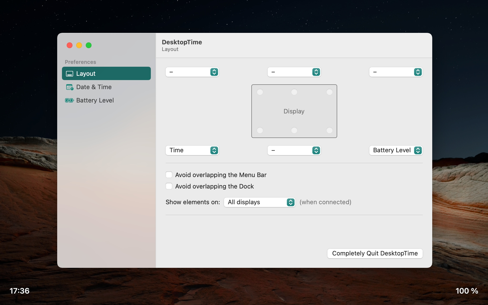

# DesktopTime
Displays the current time and date on your desktop

DesktopTime allows you to add the fully-customizable time, date and battery level on top of your desktop wallpaper.

## Usage
Launch the app to display the time. Launch the app again to show Preferences and quit.

## Features
- displays the time, date and battery level in selected screen corners
- customizable fonts and colors
- displays on the main screen, secondary screens or all screens at once

## License
Everything in this project is licensed under the [MIT license](http://opensource.org/licenses/MIT).
